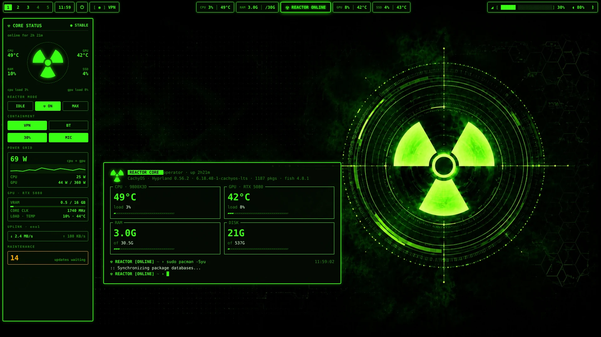
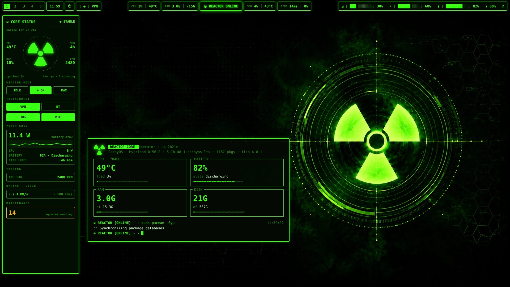

# ☢️ Custom-Linux-Waybar — REACTOR

<p align="center">
  
</p>

A complete **nuclear-reactor themed Hyprland rice** for CachyOS / Arch Linux. 🐧⚡
Radioactive-green Waybar, a slide-out control-room sidebar, a live terminal
dashboard, a fullscreen power menu, a matching launcher and a 4K wallpaper —
all wired together and installable with one command. 🚀

---

## 📦 What's inside

### 🟩 Waybar
| Module | What it does |
|---|---|
| 🔢 **Workspaces 1–5** | Click to switch, scroll to cycle. Active = solid green, has windows = bright, empty = dim. Works with both classic and Lua (0.55+) Hyprland dispatch. |
| 🕒 **Clock** | Click for date + seconds, hover for a calendar. |
| ⏻ **Power** | Opens the fullscreen REACTOR SHUTDOWN CONTROL menu. |
| 🔒 **VPN** | Tailscale status. Click to connect / disconnect. Shows the **state (US) or country** when you route through an exit node. |
| 🌡️ **CPU · RAM · GPU · SSD** | Instrument panels with two readings each. Turn **amber** when warm and **flash red** when critical. |
| ☢️ **REACTOR ONLINE** | Your power profile. Click to cycle **IDLE → ONLINE → OVERDRIVE**; right-click opens a live monitor. |
| 🔊 **Volume** | `󰕾 [██████░░░░░░░░░░░░░░] 30%` meter — scroll to adjust, click to mute, turns **red at 0%**. |
| 🎙️ **Mic · Bluetooth** | Click to mute / open Bluetooth manager, right-click for the mixer / power toggle. |

### 🎛️ Super + Z sidebar (eww)
A control-room panel that slides out from the left (animated by Hyprland on the GPU):

- 🧪 **Core status** — uptime, radiation trefoil with CPU / GPU / RAM / SSD around it
- ⚛️ **Reactor mode** — power-saver / balanced / performance buttons
- 🛡️ **Containment** — VPN, Bluetooth, speaker and mic toggles
- ⚡ **Power grid** — live CPU + GPU watts with a 60-second graph
- 🎮 **GPU** — VRAM, core / memory clocks, load and temperature
- 📡 **Uplink** — live download / upload speed with a graph
- 🔧 **Maintenance** — pending pacman + AUR updates, one-click **UPDATE**

### 🐈 Terminal (kitty + fish)
- 📊 New windows open a **REACTOR CORE dashboard**: the trefoil (a real image in kitty), and big CPU / GPU / RAM / DISK cards with filling bars
- 🟢 `☢ REACTOR [ONLINE] ~ ›` prompt that turns red with `[FAULT n]` when a command fails
- ⌨️ Type `core` to show the dashboard again, `reactor` for the live monitor

### ✨ Everything else
- 🚀 **Rofi launcher** — `☢ LAUNCH ›` command-line style with a match counter
- 🔌 **Power menu** — fullscreen, five big tiles (lock · sleep · log out · reboot · shutdown)
- 🖼️ **4K wallpaper** — top-down reactor core (`wallpapers/reactor-core-4k.png`)
- 🎨 **kitty** colours, 📈 **btop** theme, **hyprlock** and **hypridle**

---

## 💻 Laptop version

<p align="center">
  
</p>

Same design, tuned for laptops. The installer picks it **automatically when a battery is found**
(or force it with `--laptop` / `--desktop`, and it remembers your choice on updates).

| | 🖥️ Desktop | 💻 Laptop |
|---|---|---|
| **Bar center** | CPU · RAM · ☢️ · GPU · SSD | CPU · RAM · ☢️ · SSD · 📡 PING |
| **Bar right** | 🔊 volume meter | 🔊 volume · ☀️ brightness · 🔋 battery meters |
| **Sidebar core** | CPU · RAM · GPU · SSD | CPU · RAM · SSD · 🌀 **fan RPM** |
| **Power grid** | CPU + GPU watts | 🔋 battery draw · time left · CPU watts |
| **Sidebar extras** | 🎮 GPU details | 🌀 cooling (every fan's RPM) |
| **Terminal** | GPU card | 🔋 battery card |

- 🔋 Battery meter pulses while charging, turns **amber at 25%** and **flashes red at 10%** — hover for watts and time left
- ☀️ Scroll the brightness meter to adjust (never goes fully black)
- 🖱️ Right-click the battery to cycle power profiles
- 📡 **PING** shows latency │ packet loss to 1.1.1.1 — amber when slow (80 ms+) or dropping packets, red when you're offline. Click for a live ping

---

## 🛠️ Install

```bash
git clone https://github.com/KevinTechLabs/Custom-Linux-Waybar.git
cd Custom-Linux-Waybar
bash install.sh
```

Then **reload Hyprland** 🔄 (or log out and back in) and open a new kitty window.

The installer:
- 🔗 **links** every file in `dotfiles/` into `~/.config`, so `git pull` updates you instantly
- 💾 **backs up** anything it replaces as `*.backup-<date>` — nothing is deleted
- ➕ adds **one line each** to your `config.fish`, `kitty.conf` and Hyprland config (fully removed by the uninstaller)
- 🖼️ copies the wallpaper to `~/Pictures/Wallpapers/` (and sets it if you use `swww`)
- 📋 tells you which packages are missing, with the exact `pacman` command

### 📥 Packages

```bash
sudo pacman -S --needed waybar rofi eww kitty fish socat pacman-contrib \
  power-profiles-daemon wireplumber pavucontrol bluez-utils tailscale \
  ttf-jetbrains-mono-nerd
# laptops also: brightnessctl
```

`eww` may be in the AUR on some systems (`paru -S eww`). Tailscale is optional.

### ⚡ Optional: CPU watts in the sidebar
Linux only lets root read the CPU's power sensor. To show CPU watts:

```bash
sudo cp system/reactor-rapl.conf /etc/tmpfiles.d/ && sudo systemd-tmpfiles --create
```

Delete `/etc/tmpfiles.d/reactor-rapl.conf` to undo it.

### 💻 Pick a version

```bash
bash install.sh --laptop    # or --desktop  (default: laptop if a battery exists)
```

### 🪟 Optional: full Hyprland config
By default the installer only *adds* to your existing Hyprland config. If you want
the complete REACTOR `hyprland.conf` (classic syntax) as a starting point:

```bash
bash install.sh --with-hyprland-conf
```

---

## 🎮 Controls

| Where | Action | Result |
|---|---|---|
| ⌨️ Keyboard | `Super + Z` | Open / close the sidebar |
| 🔢 Workspaces | click · scroll | Switch · cycle |
| ☢️ Badge | click · right-click | Cycle power profile · live monitor |
| 🔊 Volume | scroll · click · right-click | Adjust · mute · mixer |
| 🔒 VPN | click | Connect / disconnect Tailscale |
| ⏻ Power | click | Fullscreen power menu |
| 🐈 Terminal | `core` · `reactor` | Dashboard · live monitor |

## 🔄 Update · 🗑️ Uninstall

```bash
bash scripts/update.sh   # git pull + relink
bash uninstall.sh        # remove links and added lines; backups stay
```

---

## 🗂️ Layout

```text
Custom-Linux-Waybar/
├── dotfiles-laptop/          # laptop overrides (waybar config, sidebar)
├── dotfiles/                 # mirrors ~/.config
│   ├── waybar/               # config.jsonc, style.css, scripts/
│   ├── eww/reactor/          # Super+Z sidebar
│   ├── reactor/              # terminal dashboard, fish prompt, trefoil
│   ├── rofi/                 # launcher + power menu themes
│   ├── kitty/  btop/  hypr/  # colours, theme, hyprlock, hypridle
├── wallpapers/               # 4K reactor wallpaper
├── system/                   # optional CPU-watts permission rule
├── extras/                   # wallpaper generator script
├── scripts/                  # install · update · uninstall
├── install.sh  uninstall.sh
└── preview-desktop-v2.webp · preview-laptop-v2.webp
```

## 🎨 Palette

| | Hex | Use |
|---|---|---|
| 🟩 | `#39FF14` | glow — primary |
| 🟢 | `#1F8F0B` | dim — labels, empty |
| ⬛ | `#040E03` | panels |
| 🟧 | `#FFB000` | warning / overdrive |
| 🟥 | `#FF2A2A` | critical / shutdown |

🔤 Font: **JetBrainsMono Nerd Font**

## 🩺 Troubleshooting

- 👻 **Bar disappeared** — run `waybar` in a terminal to see the error.
- 🖱️ **Workspace clicks / log out do nothing** — Hyprland 0.55+ with a Lua config changed `hyprctl dispatch`; the included scripts handle both, so re-run `bash install.sh`.
- 🎛️ **Super+Z does nothing** — reload Hyprland. Test directly with `~/.config/eww/reactor/scripts/toggle.sh`.
- 📟 **Old fastfetch still shows** — another file is printing it; the installer only comments out `fastfetch` lines in `config.fish`.
- 🌀 **Fan shows N/A** — your laptop doesn't expose a fan sensor; check with `sensors` (ThinkPads, ASUS and Dell usually do).
- 🌡️ **Temps show 0** — CPU temps need `k10temp` / `coretemp`; GPU readings need `nvidia-smi` (NVIDIA) or `amdgpu`.

☢️ Built for CachyOS + Hyprland. Most pieces work on any Arch-based Wayland setup.
